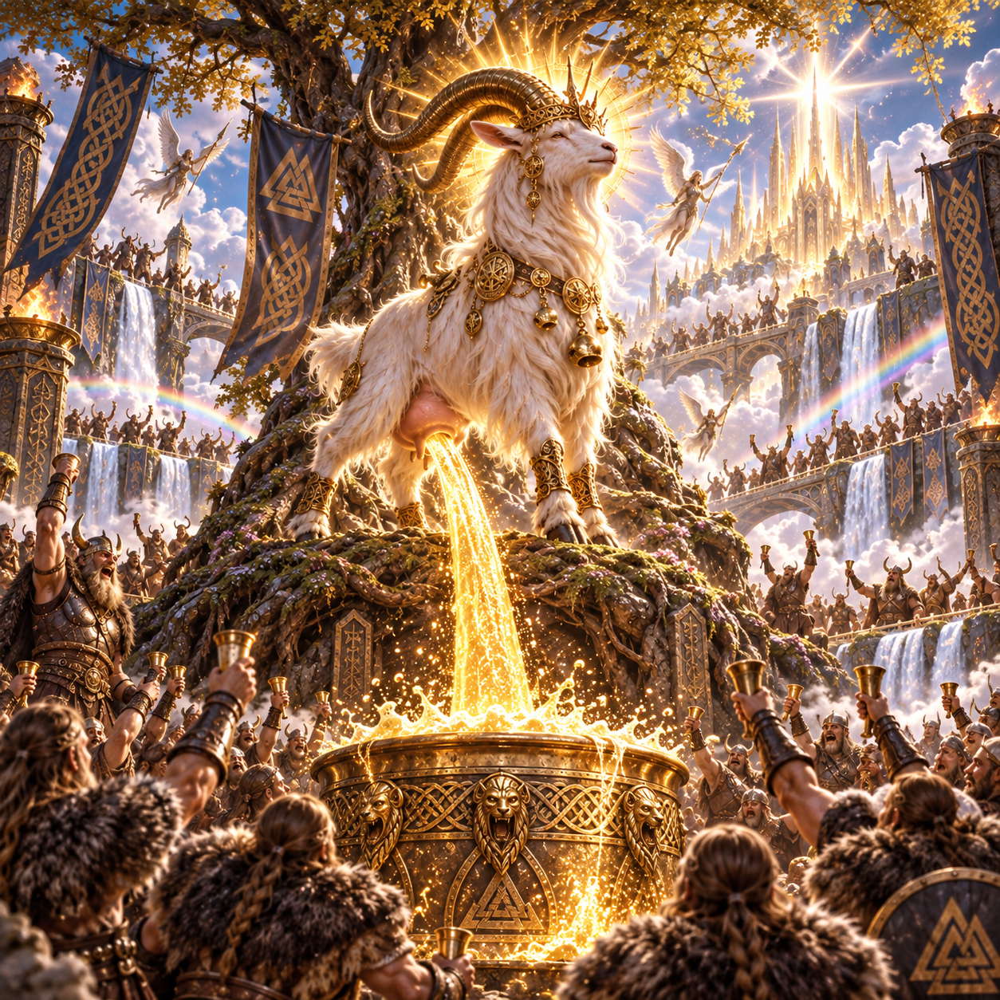

<div align="center">



# Heidrun

### With AI, every developer is THE GOAT!

**All the agents and terminals of your [Herdr](https://herdr.dev) session, in one work window. A macOS graphical interface, forged for Vikings.**

[](LICENSE)
[](https://github.com/heidrun-org/heidrun)
[](https://tauri.app)
[](packages/desktop_tauri)
[](packages/web_frontend)
[](packages/web_frontend)
[](https://github.com/heidrun-org/heidrun/issues)
[](https://github.com/heidrun-org/heidrun/commits)
[](https://heidrun-org.github.io/heidrun/about)

[**Enter Valhalla (read the documentation)**](https://heidrun-org.github.io/heidrun/documentation/) · [Who is Heiðrún?](https://heidrun-org.github.io/heidrun/about) · [Report a Ragnarök](https://github.com/heidrun-org/heidrun/issues)

</div>

---

## What it does

You run many AI agents. Each agent wants a decision, a permission, or a code review, and each one waits in a different terminal. Heidrun puts all of them in one window, and tells you which one needs you right now.

Think of Valhalla: the agents are the einherjar (the warriors who feast and fight all day), and you are the goat who keeps the mead flowing.

## Why you will like it

- **One work window.** Workspaces, panes, and a "To handle" queue of blocked or finished agents, all in one sidebar.
- **Real terminals.** Every pane shows the real Herdr terminal, so Claude Code, Codex, and all the colors look exactly as in Herdr.
- **Prompt templates.** One click writes a ready prompt into a pane. The agents never wait for a developer who is typing.
- **Inspector.** Allow or deny an agent request in one click, read the context of the agent, and ask another agent to fix a problem.
- **Quotas in view.** The status bar shows your Claude and Codex quotas. The mead never runs out by surprise.
- **Command palette.** Press <kbd>⌘</kbd><kbd>K</kbd> for every action. A real Viking does not use the mouse.
- **Phone access.** Answer a blocked agent from your iPhone, over Tailscale. Valhalla fits in a pocket.
- **Safe by default.** Dangerous commands ask for confirmation before they run. Even a berserker needs a second thought.

The full list of features, shortcuts, and settings is in the [documentation](https://heidrun-org.github.io/heidrun/documentation/).

## Quick start

You need [Herdr](https://herdr.dev) 0.9 or later, Rust stable, Node.js 20 or later, and [pnpm](https://pnpm.io).

```sh
git clone git@github.com:heidrun-org/heidrun.git
cd heidrun
pnpm install
pnpm dev
```

To build the application, run `pnpm build`, then drag `Heidrun.app` into `/Applications`.

## What is in this repository

| Package | What it is |
| --- | --- |
| [`packages/desktop_tauri`](packages/desktop_tauri) | The macOS application: the Rust backend and the Tauri shell. |
| [`packages/web_frontend`](packages/web_frontend) | The user interface, written with Vue 3 and TypeScript. |
| [`packages/website_public`](packages/website_public) | The public website and documentation, built with VitePress. |

## Contributing

Read [`AGENTS.md`](AGENTS.md) for the rules of this repository, then open an [issue](https://github.com/heidrun-org/heidrun/issues) before you start a change.

## License

[MIT](LICENSE). Skål! 🍻
